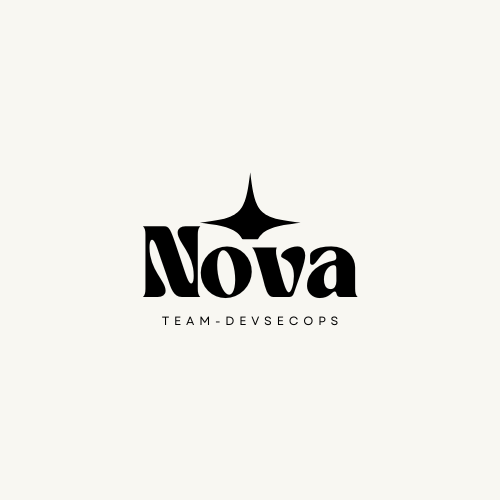

# 프로젝트 Nova


## 프로젝트 개요
DevSecOps 방법론을 적용한 온프레미스 환경의 웹 애플리케이션 개발 및 운영 환경 구축 프로젝트입니다.
보안을 고려한 CI/CD 파이프라인과 정적 분석 시스템을 구축하여 안전하고 효율적인 개발 환경을 제공합니다.

## 기술 스택
- **컨테이너 오케스트레이션**: Kubernetes (Kind)
- **CI/CD**: Git, Docker, Jenkins
- **보안 도구**: SonarQube
- **웹 서비스**: Apache, PHP, MariaDB
- **버전 관리**: Git

## 프로젝트 구조
```
.
├── docs/                    # 문서화 자료
├── jenkins/                # Jenkins CI/CD 서버
│   └── k8s/                # Jenkins Kubernetes 매니페스트
├── kubernetes/             # Kubernetes 클러스터 설정
│   ├── kind-config.yaml    # Kind 클러스터 설정
│   └── manifests/          # 쿠버네티스 매니페스트 파일
├── sonarqube/             # SonarQube 정적 분석 도구
│   └── k8s/                # SonarQube Kubernetes 매니페스트
└── web/                    # 웹 애플리케이션
    ├── src/                # PHP 소스 코드
    ├── db/                 # MariaDB 설정 및 스키마
    └── k8s/                # 웹 서비스 Kubernetes 매니페스트
```

## 컴포넌트 설명

### 1. Kubernetes 클러스터 (/kubernetes)
- Kind를 사용한 온프레미스 Kubernetes 클러스터 구성
- 워커 노드별 역할 분리 (웹서버, Jenkins, SonarQube 등)
- 자동화된 클러스터 구성 및 관리

### 2. CI/CD 파이프라인 (/jenkins)
- Git을 통한 버전 관리
- Docker를 이용한 컨테이너화
- Jenkins를 활용한 자동화된 빌드 및 배포
- GitHub 웹훅을 통한 자동 빌드 트리거

### 3. 보안 시스템 (/sonarqube)
- SonarQube를 통한 코드 정적 분석
- 보안 취약점 스캔
- 코드 품질 메트릭 분석
- Jenkins 파이프라인 통합

### 4. 웹 애플리케이션 (/web)
- Apache 웹 서버 기반 구성
- PHP 애플리케이션 서버
- MariaDB 데이터베이스
- 컨테이너화된 구성 요소

## 시작하기

### 사전 요구사항
- Docker
- Kind (Kubernetes in Docker)
- Git
- Windows 운영체제

### 설치 및 실행
1. Kubernetes 클러스터 생성:
```bash
cd kubernetes
kind create cluster --config kind-config.yaml
```

2. Jenkins 및 SonarQube 배포:
```bash
.\deploy.bat
```

3. 웹 서비스 배포:
```bash
kubectl apply -f web/k8s/
```

## 접속 정보
- Jenkins: http://localhost:8080
- SonarQube: http://localhost:9000
- 웹 서비스: http://localhost:80

## 보안 검사
1. Jenkins 파이프라인에서 자동으로 SonarQube 정적 분석 수행
2. 코드 품질 및 보안 취약점 리포트 생성
3. 품질 게이트 기준에 따른 배포 승인/거부

## 참고 자료
- Kubernetes: https://kubernetes.io/
- Jenkins: https://www.jenkins.io/
- SonarQube: https://www.sonarqube.org/
- Apache: https://httpd.apache.org/