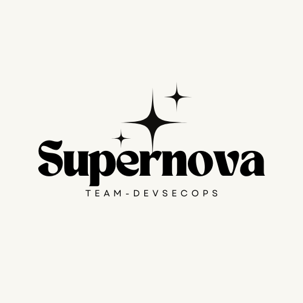

# 프로젝트 SuperNova

## 프로젝트 개요
DevSecOps 팀의 마지막 협력 프로젝트로, 가상의 게임 개발사 G.G.M(Good Game Maker)을 대상으로 네트워크/보안/사후관리 서비스를 제공하는 통합 프로젝트입니다. 네트워크 팀, 블루팀, 레드팀이 협력하여 클라이언트의 요구사항을 분석하고 최적의 솔루션을 제공하는 과정을 담고 있습니다.

## 클라이언트 정보
- **회사명**: G.G.M (Good Game Maker)
- **업종**: 게임 개발
- **특징**: 신생 게임 개발사
- **요구사항**: 네트워크 인프라 구축, 보안 시스템 구축, 운영 관리 시스템 구축

## 프로젝트 팀 구성

### 1. 네트워크 팀
- **주요 역할**
  - 네트워크 인프라 설계 및 구축
  - 트래픽 모니터링 시스템 구축
  - 네트워크 성능 최적화
  - 로드 밸런싱 구성

### 2. 블루팀
- **주요 역할**
  - 보안 정책 수립
  - 보안 시스템 구축
  - 취약점 분석 및 대응
  - 모니터링 시스템 구축
  - 백업 및 복구 시스템 구현

### 3. 레드팀
- **주요 역할**
  - 모의해킹 수행
  - 침투 테스트
  - 보안 취약점 발견 및 보고
  - 보안 강화 방안 제시

## 프로젝트 단계

### 1단계: 요구사항 분석 및 설계
- 클라이언트 요구사항 수집 및 분석
- 네트워크 구성도 작성
- 보안 정책 설계
- 운영 관리 계획 수립

### 2단계: 구축 및 구현
- 네트워크 인프라 구축
- 보안 시스템 구현
- 모니터링 시스템 구축
- 운영 관리 시스템 구현

### 3단계: 테스트 및 검증
- 네트워크 성능 테스트
- 보안 취약점 진단
- 모의해킹 수행
- 시스템 안정성 검증

### 4단계: 최적화 및 문서화
- 발견된 문제점 개선
- 보안 취약점 보완
- 운영 매뉴얼 작성
- 최종 보고서 작성

## 주요 산출물
1. 네트워크 구성도(토폴로지)
2. 보안 정책 문서(+ 점검 스크립트)
3. 취약점 분석 보고서
4. 모의해킹 결과 보고서
5. 운영 매뉴얼
6. 시스템 구축 완료 보고서

## 기대 효과
1. 체계적인 네트워크 인프라 구축
2. 강력한 보안 시스템 확보
3. 효율적인 운영 관리 체계 수립
4. 팀 간 협업 경험 축적
5. 실무 중심의 프로젝트 경험 획득

## 프로젝트 일정
- **1단계**: 1주
- **2단계**: 1주
- **3단계**: 1주
- **4단계**: 1주
- **총 프로젝트 기간**: 4주

## 참고 자료
- 네트워크 설계 표준 문서
- OWASP Top 10
- 정보보호 관리체계(ISMS) 인증 기준
- DevSecOps 모범 사례
- 클라우드 보안 가이드라인