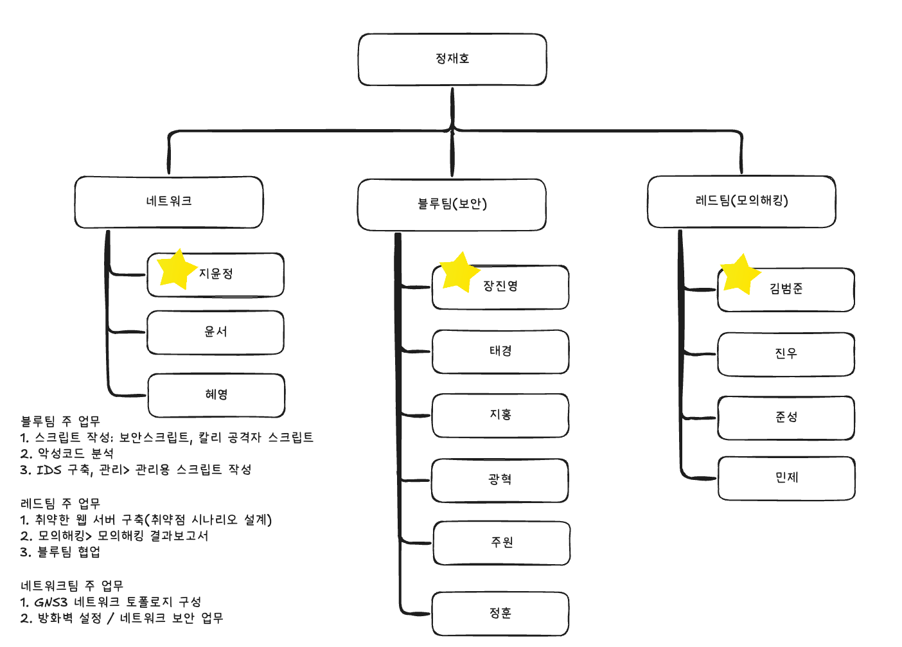

# 프로젝트 SuperNova

## 프로젝트 개요
DevSecOps 팀의 마지막 협력 프로젝트로, 가상의 게임 개발사 G.G.M(Good Game Maker)을 대상으로 네트워크/보안/사후관리 서비스를 제공하는 통합 프로젝트입니다. 네트워크 팀, 블루팀, 레드팀이 협력하여 클라이언트의 요구사항을 분석하고 최적의 솔루션을 제공하는 과정을 담고 있습니다.

## 클라이언트 정보
- **회사명**: G.G.M (Good Game Maker)
- **업종**: 게임 개발
- **특징**: 신생 게임 개발사
- **요구사항**: 네트워크 인프라 구축, 보안 시스템 구축, 운영 관리 시스템 구축

## 프로젝트 팀 구성

### 팀 조직도

### 팀별 주요 역할

| 팀 | 주요 역할 |
|:---:|:---|
| **네트워크 팀** | • 네트워크 인프라 설계 및 구축 • 트래픽 모니터링 시스템 구축 • 네트워크 성능 최적화 • 로드 밸런싱 구성 |
| **블루팀** | • 보안 정책 수립 • 보안 시스템 구축 • 취약점 분석 및 대응 • 모니터링 시스템 구축 • 백업 및 복구 시스템 구현 |
| **레드팀** | • 모의해킹 수행 • 침투 테스트 • 보안 취약점 발견 및 보고 • 보안 강화 방안 제시 |

## 프로젝트 단계

| 단계 | 주요 작업 내용 |
|:---:|:---|
| **1단계** 요구사항 분석 및 설계 | • 클라이언트 요구사항 수집 및 분석 • 네트워크 구성도 작성 • 보안 정책 설계 • 운영 관리 계획 수립 |
| **2단계** 구축 및 구현 | • 네트워크 인프라 구축 • 보안 시스템 구현 • 모니터링 시스템 구축 • 운영 관리 시스템 구현 |
| **3단계** 테스트 및 검증 | • 네트워크 성능 테스트 • 보안 취약점 진단 • 모의해킹 수행 • 시스템 안정성 검증 |
| **4단계** 최적화 및 문서화 | • 발견된 문제점 개선 • 보안 취약점 보완 • 운영 매뉴얼 작성 • 최종 보고서 작성 |

## 주요 산출물
1. 네트워크 구성도(토폴로지)
2. 보안 정책 문서(+ 점검 스크립트)
3. 취약점 분석 보고서
4. 모의해킹 결과 보고서
5. 운영 매뉴얼
6. 시스템 구축 완료 보고서

## 기대 효과
1. 체계적인 네트워크 인프라 구축
2. 강력한 보안 시스템 확보
3. 효율적인 운영 관리 체계 수립
4. 팀 간 협업 경험 축적
5. 실무 중심의 프로젝트 경험 획득

## 프로젝트 일정
- **1단계**: 1주
- **2단계**: 1주
- **3단계**: 1주
- **4단계**: 1주
- **총 프로젝트 기간**: 4주

## 참고 자료
- 네트워크 설계 표준 문서
- OWASP Top 10
- 정보보호 관리체계(ISMS) 인증 기준
- DevSecOps 모범 사례
- 클라우드 보안 가이드라인