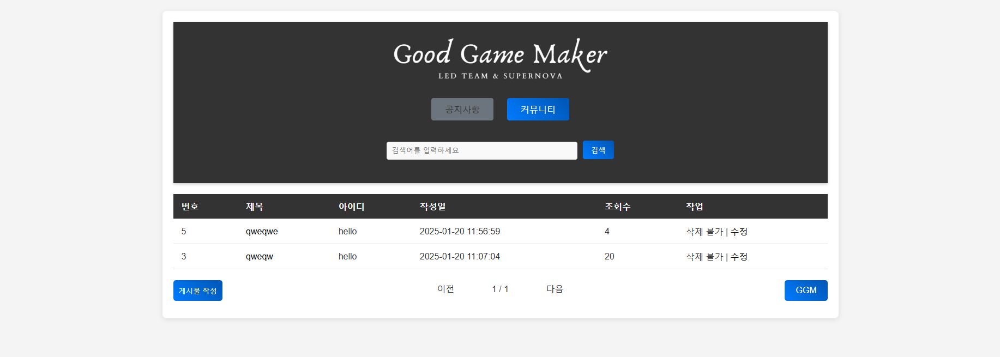
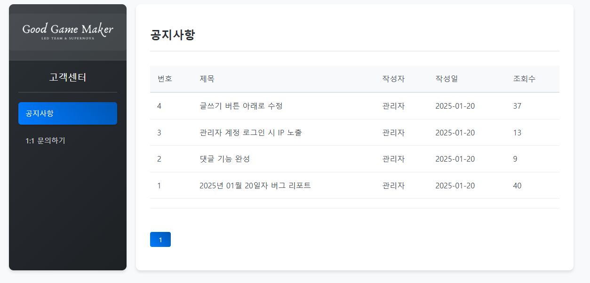
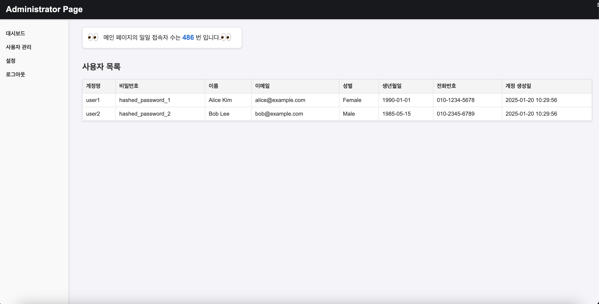

# 모의해킹 및 취약점 분석 (레드팀)

## 보안 침투 테스트 업무 요청사항

1. 웹 서비스 모의해킹
   - 기존 웹 서버 취약점 분석 및 침투 테스트
   - OWASP Top 10 기반 취약점 점검
   - 모의해킹 결과 보고서 작성
   - 취약점 개선 권고안 제시

2. 네트워크 침투 테스트
   - VPN 시스템 보안성 테스트
   - 외부 네트워크 침투 시나리오 테스트
   - 내부 네트워크 접근 통제 우회 테스트
   - 서버 인프라 취약점 분석

3. DDoS 공격 시뮬레이션
   - DDoS 공격 시나리오 개발
   - 스트레스 테스트 수행
   - 방어 체계 효과성 검증

## 모의해킹 대상

### 1. 기업 공식 홈페이지

#### 1.1. 메인 페이지

#### 1.2. 전체공지/커뮤니티 게시판
> 주요 기능: 글쓰기, 수정, 삭제, 파일 업로드, 검색

**권한 설정**
- **관리자 계정**
  - 공지사항 글쓰기 가능
  - 수정/삭제 불가능 (현재는 본인 글만 수정, 삭제 가능 → 추후 변경 예정)
- **일반회원 계정**
  - 본인 글만 수정, 삭제 가능

#### 1.3. 고객센터 게시판
> 주요 기능: 글쓰기, 수정, 삭제

**권한 설정**
- **관리자 계정**
  - 공지사항 글쓰기 가능
  - 댓글 작성 가능
  - 문의자 정보 확인 가능 (IP, ID, E-mail)
- **일반회원 계정**
  - 본인 글만 보기, 수정, 삭제 가능

#### 1.4. 프로필
> 주요 기능
- 이미지 업로드
- 닉네임 변경
- 이메일 변경
- 소개글 작성

#### 1.5. 관리자 페이지
> 주요 기능: 방문자 수 / 사용자 목록 관리

**접근 제한**
- 관리자 계정으로만 접속 가능
- Localhost(127.0.0.1) 상태에서만 접속 가능
