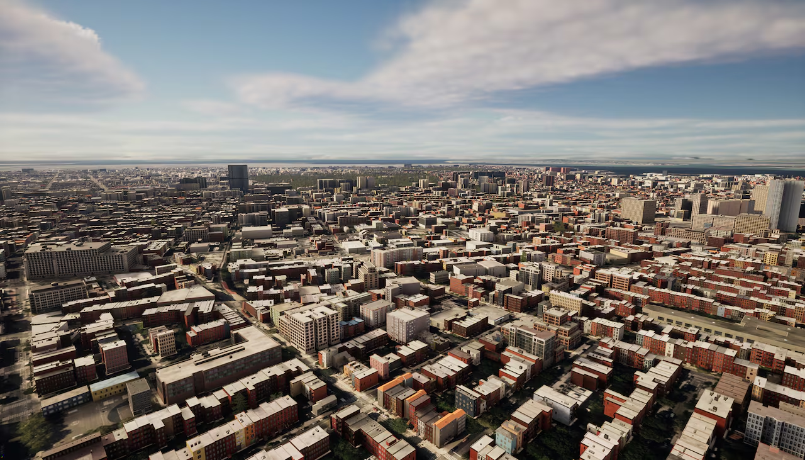
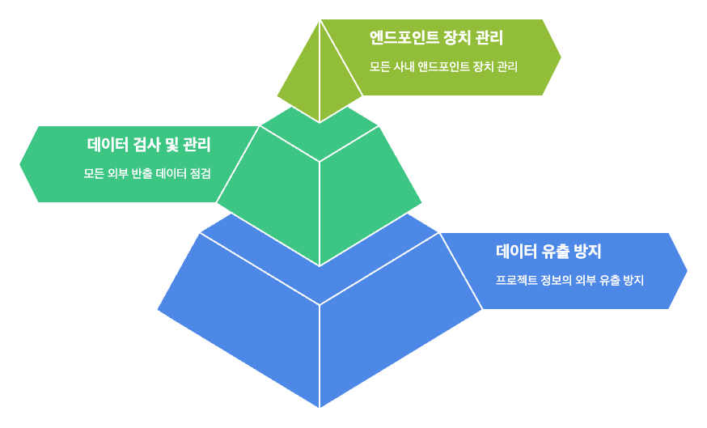
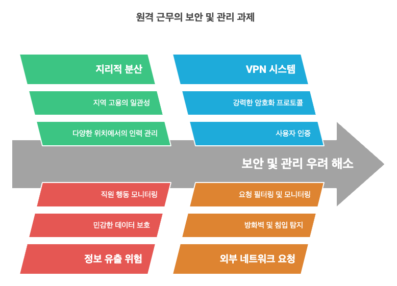
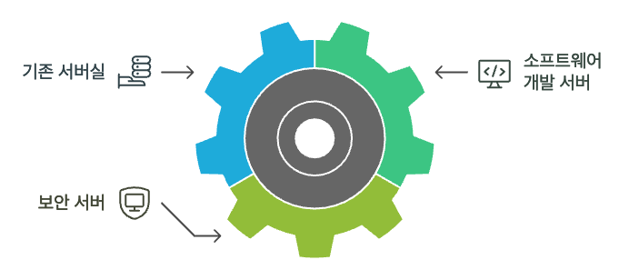
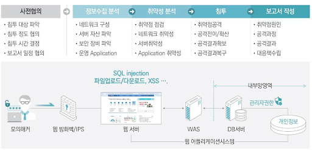
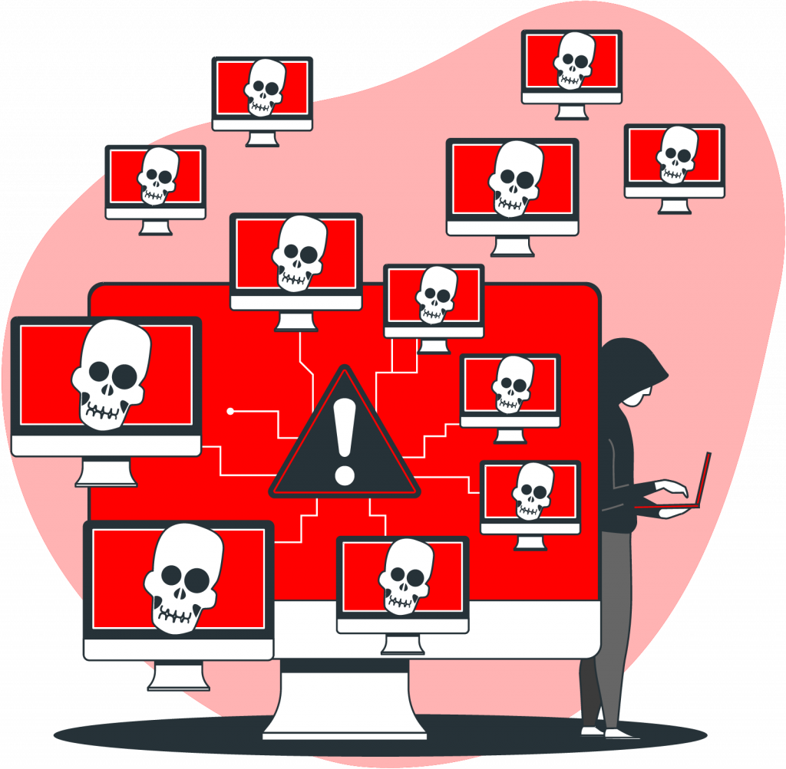

# 상황 시나리오
대구광역시 00구 000-00에 위치한 상업용 빌딩  
게임, 소프트웨어 개발 업종의 신생 기업 G.G.M에서 외주 의뢰가 도착했습니다.  

최근 모기업 Korea IT 로 부터 독립하여 새로운 프로젝트를 진행하고자 사옥 이전을 하였습니다.  
해당 업체의 요청사항은 다음과 같습니다.  

# 요청사항

## 1. 첫째도 보안 둘째도 보안

- 프로젝트에 대한 정보가 외부로 유출되는 것을 극도로 신경쓰는 상황입니다.
- 회사 내에서 외부로 반출되는 모든 데이터를 점검하고 관리하고자 합니다.
- 또한, 사내에 운영되는 모든 앤드포인트 장치에 대하여 관리를 하고자 합니다.

## 2. 재택근무의 양면성에 대한 우려

- 업체는 지역 회사임으로 타 지역의 인제를 수용하기 위해 100% 재택근무제도를 시행하려고 합니다.
- 정보 유출을 우려하는 업체 특성을 반영해 효과적인 VPN 시스템이 구축되어야할 것입니다.
- 그 외에도 외부 네트워크에서 들어오는 요청에 대해서 안정하게 방어하고 관리할 수 있는 시스템 구축을 요청합니다.

## 3. 자체 서버실 운영

- 업체에는 이미 지하에 서버실과 웹 서비스가 구동중입니다.
- 기존의 서버실에 소프트웨어 개발 서버와 보안 서버 구축을 요청하였습니다.

## 4. 서비스 중인 웹 서비스에 대한 보안점검

- 모 회사 Korea IT의 자회사일 때 구축한 웹 서버, 서비스로 보안 취약점 점검 의뢰를 추가하였습니다.
- 모의해킹 결과 보고서 1종과 점검/관리 스크립트 제작을 의뢰했습니다.

## 5. DDoS 공격 방어 

- 최근 게임/IT 업계 보안 이슈로 자주 언급되는 요소입니다.
- 업체에서는 과거 게임 서버와 웹 서버에 가해진 DoS 공격을 경험한 사례가 있습니다.
- 사옥을 이전하며 DDoS 공격에 대한 최소한의 방어 대책을 적용하고자 합니다.